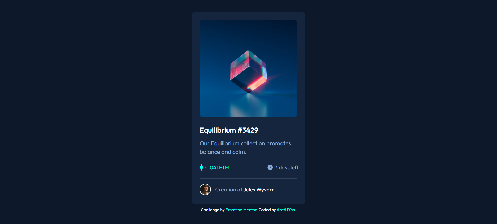
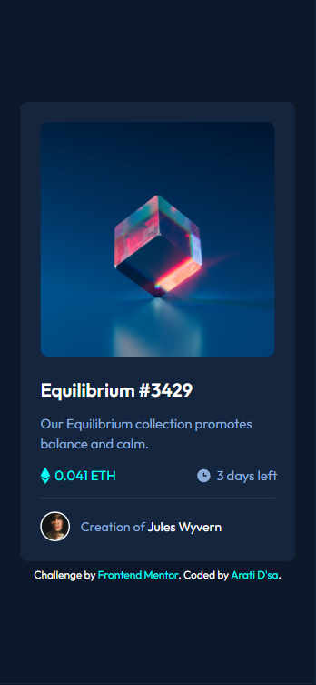

  

<h1 align="center">
  🌟NFT Preview Card Component
</h1>

A responsive solution to the NFT Preview Card Component challenge on Frontend Mentor.

<h3 align="center">
  🌐 <a href="https://codecove01-netizen.github.io/NFT-Preview-Card-Component/">Live Demo</a>
  &nbsp;|&nbsp;
  📂 <a href="https://github.com/codecove01-netizen/NFT-Preview-Card-Component">Source Code</a>
  &nbsp;|&nbsp;
  🎯 <a href="https://www.frontendmentor.io/challenges/nft-preview-card-component-SbdUL_w0U">Challenge</a>
</h3>

 

  
  &nbsp;&nbsp;
  
  &nbsp;&nbsp;
  

<h1 align="left">
  📸 Layout Overview
</h1>

<h3 align="center">💻 Desktop View</h3>

  

 

<h3 align="center">📱 Mobile View</h3>

  

---
## 🚀 Built With

  
  
  
  

- Semantic HTML5 markup
- CSS custom properties
- Flexbox
- Mobile-first workflow
- Responsive design principles
- CSS pseudo-elements and pseudo-classes (`::after`, `:hover`, `:focus-visible`)

---

<h2 align="left">🛠️ Tools Used</h2>

  
  
  
  

---
## 💡 What I Learned

While building this project, I strengthened my understanding of:

- Improved my understanding of **semantic HTML5** and structuring content using meaningful elements.
- Practiced building responsive layouts using **Flexbox**.
- Learned how to create an image hover overlay effect using **CSS pseudo-elements (`::after`)**.
- Gained experience implementing **hover** and **`:focus-visible`** states for better user interaction.
- Improved my understanding of **keyboard accessibility** and focus management.
- Used **CSS custom properties (variables)** to create a more maintainable and consistent design system.
- Applied **relative units (`rem`)** and **fluid typography (`clamp()`)** to improve responsiveness.
- Learned how to position overlay elements using **relative and absolute positioning**.
- Practiced organizing CSS with clear sections, comments, and reusable styles for better readability.
- Strengthened my ability to recreate a design accurately from a provided mockup.

---

## 🎯 The Challenge

- Build out this social links profile and get it looking as close to the design as possible.
- users should be able to:
  1. View the optimal layout depending on their device's screen size
  2. See hover and focus states for interactive elements
- Try estimating the time it will take for you to build the project. Then see if the time taken matches up to your estimate.
---

## ⏱️ Time Estimation

- Estimated time: 2 hours
- Actual time: 2 hours 22 minutes

The project took slightly longer than expected due to layout refinements, responsive image implementation, and accessibility improvements.

---
<h2 align="left">🌐 Connect With Me</h2>

  
&nbsp;&nbsp;
  
&nbsp;&nbsp;
  

---

## 🙏 Acknowledgments

Thanks to **Frontend Mentor** for providing practical challenges that help developers strengthen their frontend skills through hands-on learning.
